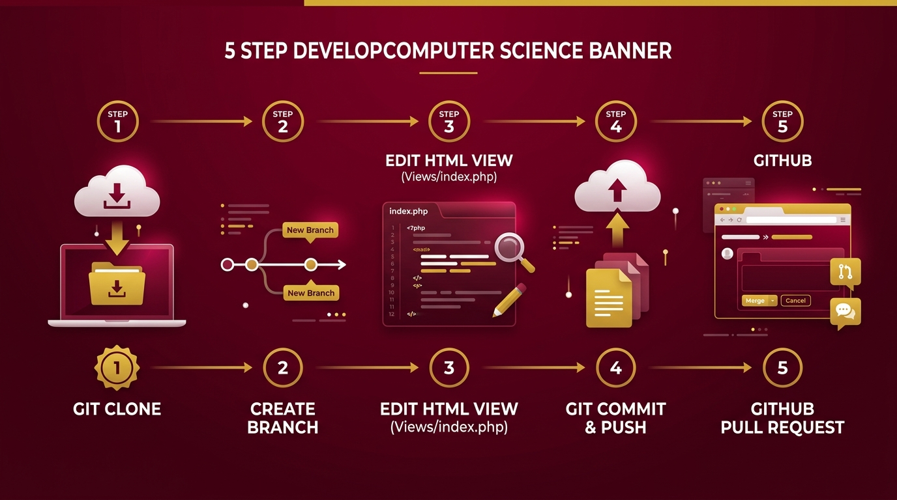
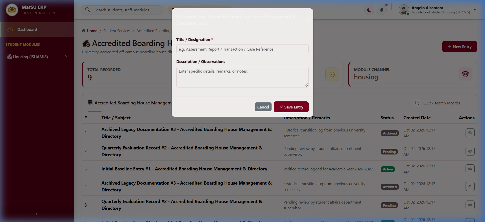

# MarSU ERP — Student Developer Starter Guide
### Step-by-Step: From Cloning to Your First Pull Request (Pure HTML/CSS First)



Welcome, MarSU Student Developers!

For this initial milestone, **you do NOT need to touch backend PHP, SQL, or database migrations**. Your goal is simply to set up the project on your laptop, create your group's branch, and customize **one single file (`Views/index.php`)** using pure HTML/CSS so the Lead Admin can review your changes on GitHub!

---

## The Golden Rule

> [!IMPORTANT]
> **DO NOT modify files inside `core/`, `app/`, or `scripts/`.**  
> Your group's work must live **STRICTLY** inside your assigned module directory:  
> `modules/<your_module>/` (for example: `modules/health/` or `modules/housing/`)

---

## Phase 1: Setup from the Very Beginning (From Scratch)

### 1. Requirements on Your Laptop:
- **XAMPP** (with Apache and MySQL started)
- **Git** (Git Bash installed)
- **GitHub Account** (Sign up at [github.com](https://github.com) if you haven't yet)

---

### 2. How to Clone the Repository
1. Open **Git Bash**.
2. Navigate to your XAMPP web root folder:
   ```bash
   cd /c/xampp/htdocs
   ```
3. Clone the official MarSU ERP repository:
   ```bash
   git clone https://github.com/alfredevin/marsu_sc.git
   ```
   *(This creates a folder at `C:\xampp\htdocs\marsu_sc` on your laptop).*

---

### 3. Setup Your Local Database (1-Minute Setup)
1. Open **XAMPP Control Panel** and make sure both **Apache** and **MySQL** are running (green).
2. Open your browser and go to: `http://localhost/phpmyadmin`
3. Click **New** (on the left sidebar), name the database **`marsu_erp`**, and click **Create**.
4. In Git Bash, enter your project folder and run the migration and seed scripts:
   ```bash
   cd /c/xampp/htdocs/marsu_sc
   php scripts/migrate.php
   php scripts/seed.php
   ```
5. Open your browser and go to: `http://localhost/marsu_sc/`  
   The ERP login page should now appear!

---

### 4. How to Open the Project in VS Code or Code Editor
In Git Bash, while inside the project directory, run:
```bash
code .
```
*(Note: May space at tuldok pagkatapos ng `code`. Ang command na `code .` ang awtomatikong magbubukas ng buong folder sa **Visual Studio Code**).*

> [!TIP]
> - Kung **Antigravity IDE** ang gamit: I-type ang `agy .` o buksan via **File > Open Folder** $\rightarrow$ piliin ang `C:\xampp\htdocs\marsu_sc`.
> - Kung gusto mong buksan sa **Windows File Explorer** mula terminal: I-type ang `explorer .` o `start .`

---

## Phase 2: Create Your Group's Branch

**NEVER code directly on the `master` branch.** Always create a separate branch for your group so your work doesn't conflict with other groups.

Inside `/c/xampp/htdocs/marsu_sc`, run:
```bash
git checkout -b feature/group-name
```
*Example for Housing group (ISHAMIS):*
```bash
git checkout -b feature/housing-ishamis
```
*(Or for your own assigned module: `feature/health-clinic`, `feature/guidance-records`, etc.)*

---

## Phase 3: The ONLY File You Need to Edit for Now (`Views/index.php`)

Do **not** worry about the database or backend right now. Focus on designing your module's interface!

Open this single file in VS Code or your code editor:
`modules/housing/Views/index.php` *(or your own module's `Views/index.php`)*

### What to Customize (Pure HTML & Bootstrap):

#### 1. Page Title & Description (Near the top):
```html
<h1 class="h3 font-weight-bold text-marsu-burgundy mb-1">
    <i class="bi bi-house-check-fill me-2 text-gold"></i>Student Housing & Accommodation (ISHAMIS)
</h1>
<p class="text-muted small mb-0">Directory of university-accredited boarding houses and student bed spaces in Santa Cruz Campus.</p>
```

#### 2. Table Column Headers (Inside `<thead>`):
Change the column headers to match your module's records:
```html
<thead class="table-marsu">
    <tr>
        <th>#</th>
        <th>Boarding House Name / Landlord</th>
        <th>Monthly Rate / Amenities</th>
        <th>Accreditation Status</th>
        <th>Date Listed</th>
        <th class="text-end">Actions</th>
    </tr>
</thead>
```

#### 3. Modal Form Input Labels (Inside `<div class="modal-body">`):
Change the input labels so users know what to enter:
```html
<div class="mb-3">
    <label class="form-label small fw-bold">Boarding House Name <span class="text-danger">*</span></label>
    <input type="text" name="title" class="form-control form-control-sm" required placeholder="e.g. Villa Marinduque Student Residence">
</div>

<div class="mb-3">
    <label class="form-label small fw-bold">Landlord Contact & Monthly Rate / Amenities</label>
    <textarea name="description" class="form-control form-control-sm" rows="3" placeholder="Landlord: Maria Santos (0917-xxx-xxxx) • Rate: ₱1,500/month • Free WiFi & Water"></textarea>
</div>
```

---

### Visual Preview & Walkthrough Demonstration
Here is how your custom module and modal form look in the browser:



> [!TIP]
> **Video Demonstration**: You can watch the full recorded session walkthrough video located at [`docs/videos/student_walkthrough.webp`](docs/videos/student_walkthrough.webp) showing login, workspace navigation, and modal form opening!

---

## Phase 4: Save, Commit, Push, and Pull Request (Submit to Lead)

Once you test your page on `http://localhost/marsu_sc/` and it looks great, it's time to submit your work to the Lead Admin!

### 1. Stage and Check Your Modified File:
```bash
git status
```
*(You should see `modules/housing/Views/index.php` in red or green).*

### 2. Stage Your File:
```bash
git add modules/housing/Views/index.php
```

### 3. Commit with a Clear Message:
```bash
git commit -m "feat(housing): customize index view title, table, and form"
```

### 4. Push Your Branch to GitHub:
```bash
git push -u origin feature/housing-ishamis
```

---

## Phase 5: Submit the Pull Request (PR)

1. Open the project GitHub repository in your browser:  
   `https://github.com/alfredevin/marsu_sc`
2. You will see a banner at the top saying:  
   `"feature/your-group-name had recent pushes — Compare & pull request"`
3. Click the green button: **Compare & pull request**.
4. Write a short description of what your group customized in `Views/index.php`.
5. Click **Create pull request**.

The Lead Admin (Alfred) will be notified, inspect your HTML changes, and merge your branch into the master project!

---

## Appendix: What About the Database and Backend? (For Phase 2)

Once your group's initial UI design is approved by the Lead, you can start connecting dynamic database columns:

1. **How Data Flows**:
   - `HTML Form (Views/index.php)` sends input data.
   - `Controllers/HomeController.php` receives it via `$_POST` and runs `Database::insert()`.
   - Data is stored in your MySQL table (`prefix_records`).
   - `Views/index.php` displays rows via `<?php foreach ($records as $r): ?>`.

2. **Testing Your Group Account**:
   - Each group lead has a dedicated account (e.g., `group4_lead`, `group7_lead`, password: `Password123!`).
   - When you log in with your group lead account, your sidebar will **only** display your assigned module!
